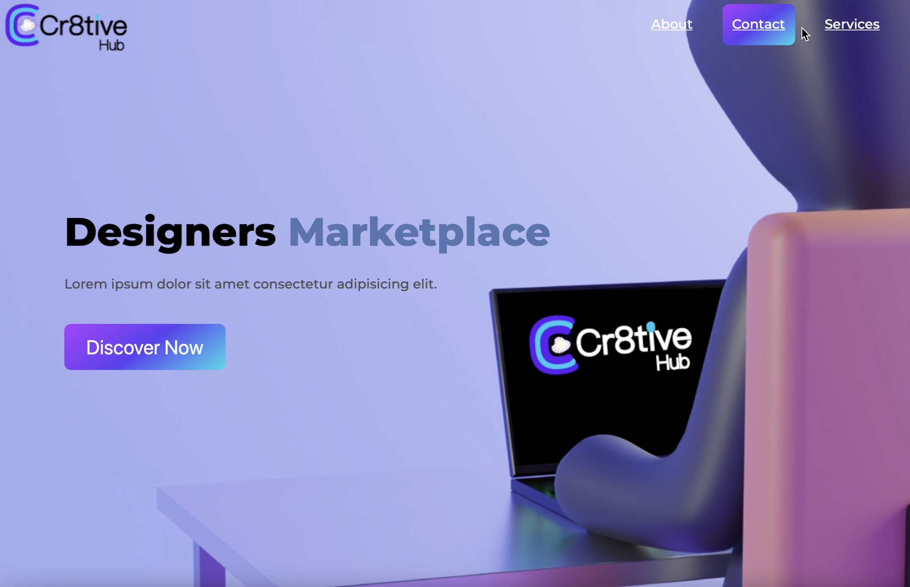

## DEMO:

[![Watch the Demo]](Landingpage.mov)

# E-commerce Landing Page

Hey there! 👋 Welcome to the E-commerce Landing Page project! This landing page is not just about selling products; it's about providing an exceptional user experience.

## Features

### Accessibility Testing

I've put a strong emphasis on accessibility. Through rigorous testing using automated tools and assistive technologies, I've made sure that every user, regardless of their abilities, can navigate and use the landing page seamlessly.

- I've experience the website using assistive technologies such as screen readers to ensure a delightful user experience for everyone.


### SASS Animations

I've incorporated SASS animations and transitions. These little details not only enhance user interactions but also provide delightful visual feedback, making the landing page more engaging.


## Getting Started


### Responsive Design

- I've test the responsiveness using various devices or browser developer tools.
- I'm sure the design looks amazing on different screen sizes.

### Running Locally

To experience the awesomeness locally, follow these steps:

1. Clone the repository:

    ```bash
    git clone
    cd e-commerce-landing-page
    ```

2. Open the `index.html` file in your favorite browser.


